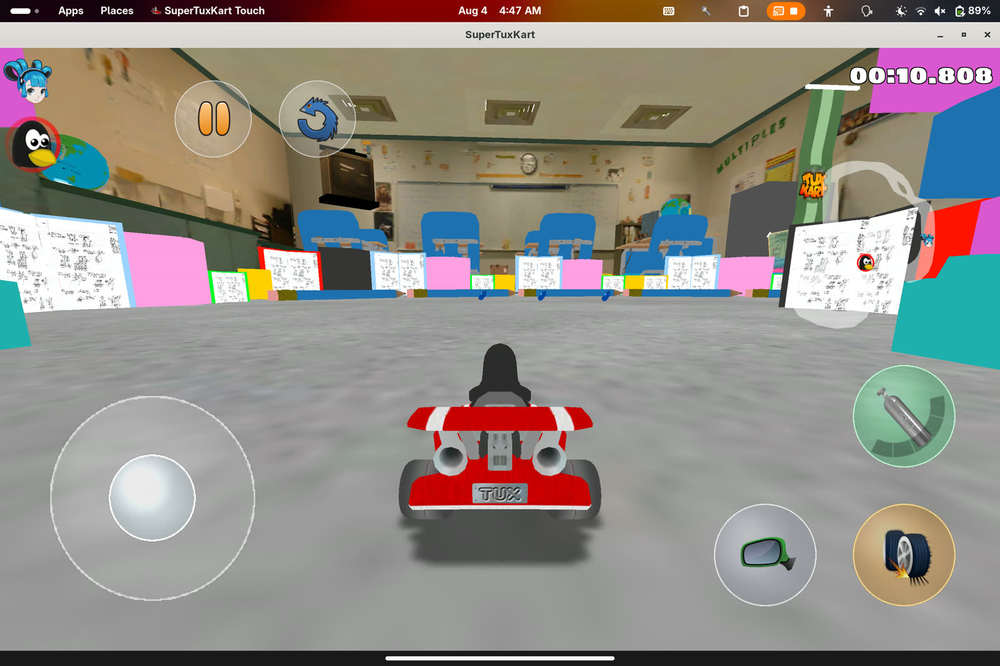

# SuperTuxTouch

Touch-first [SuperTuxKart](https://supertuxkart.net/) for Linux tablets and phones (**not** the Flathub `net.supertuxkart.SuperTuxKart` app). Glass virtual stick, drift / item / nitro buttons, touch settings, and an in-game screen keyboard. Defaults favour **thermal** headroom on fanless devices (30 FPS, reduced render scale).

| | |
|---|---|
| **Name** | SuperTuxTouch |
| **Flatpak id** | `io.github.dixonSolutions.SuperTuxKartTouch` |
| **Flatpak remote** | `supertuxtouch` |
| **Install** | Flatpak remote, offline `.flatpak` on Releases, Ubuntu Touch `.click` / OpenStore |
| **Platforms** | Flatpak: `x86_64` + `aarch64`. Click: `arm64` + `armhf` |
| **Assets** | Slim package — reuses Flathub STK tracks/karts when installed |

<p align="center">
  
</p>

## Install (Flatpak remote)

```bash
# Race assets (once) — stock STK stays on Flathub; this remote is separate
flatpak install -y flathub net.supertuxkart.SuperTuxKart

flatpak remote-add --user --if-not-exists --no-gpg-verify supertuxtouch \
  https://dixonSolutions.github.io/SuperTuxKart-Touch/flatpak
flatpak install --user supertuxtouch io.github.dixonSolutions.SuperTuxKartTouch
flatpak run io.github.dixonSolutions.SuperTuxKartTouch
```

Offline bundles (same app id) are attached to every [GitHub Release](https://github.com/dixonSolutions/SuperTuxKart-Touch/releases/latest):

```bash
flatpak install --user SuperTuxKartTouch-*-x86_64.flatpak
```


### Ubuntu Touch (.click)

Preferred: OpenStore app `supertuxkarttouch.dixonsolutions` (when published).

Sideload:

```bash
wget https://dixonSolutions.github.io/SuperTuxKart-Touch/click/latest-arm64.click
pkcon install-local --allow-untrusted latest-arm64.click
```

## Performance

| Profile | Env | Notes |
|---------|-----|--------|
| **thermal** (default) | `STK_TOUCH_PERF=thermal` | 30 FPS, RTT 0.55, lights/shadows off |
| balanced | `STK_TOUCH_PERF=balanced` | 45 FPS, mid quality |
| quality | `STK_TOUCH_PERF=quality` | 60 FPS, richer graphics |

```bash
STK_TOUCH_PERF=balanced flatpak run io.github.dixonSolutions.SuperTuxKartTouch
```

## Maintainer workflow

```bash
./scripts/build-engine.sh
./scripts/install-flatpak.sh --prebuilt --run   # tablet / local from binary
# or full flatpak-builder:
./scripts/install-flatpak.sh --clean
```

| Path | Purpose |
|------|---------|
| `engine/` | stk-code fork (`TOUCH_STK`, glass HUD) |
| `packaging/start.sh` | Launcher: Flathub asset discover, glass overlay, perf |
| `flatpak/` | Manifest, desktop, metainfo |
| `click/` | Ubuntu Touch click metadata |
| `touch/` | Config snippets |
| `docs/` | Architecture, releases, media |

## Docs

- [docs/RELEASES.md](docs/RELEASES.md) — Flatpak + Click remotes, OpenStore
- [docs/SETUP.md](docs/SETUP.md) — build & tablet run
- [docs/ARCHITECTURE.md](docs/ARCHITECTURE.md) — design decisions

## License

GPL-3 — same as SuperTuxKart upstream.
