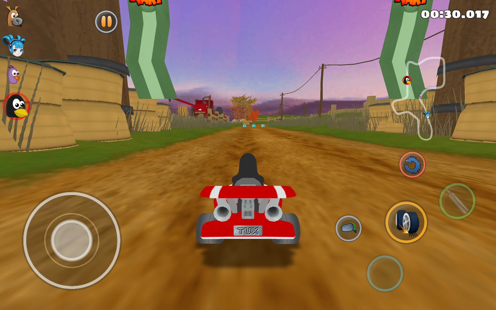
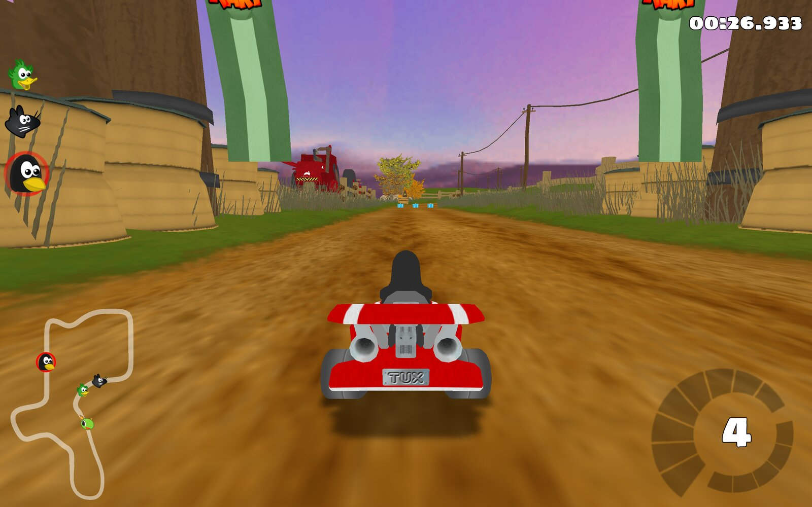

# Touch hardware detection

Upstream SuperTuxKart already has the control plane:

| Param | Values |
|-------|--------|
| `multitouch_active` | 0 = off, 1 = auto (if available), 2 = always |
| `multitouch_draw_gui` | Show the on-screen race buttons |
| `multitouch_controls` | Steering wheel / accelerometer / gyroscope |

Android and iOS assume a touchscreen. Linux tablets do not. This port keeps that
0/1/2 switch and adds a real scan plus a touch-only filter.

## What was missing

`CIrrDeviceSDL::supportsTouchDevice()` was only `SDL_GetNumTouchDevices() > 0`.
On Linux that is often 0 until the first finger, and convertibles with a
keyboard were treated the same as a phone.

`main_touch.cpp` used to **force** `multitouch_active = 2` after config load, so
the Auto setting could not stick.

## What we added

| Piece | Role |
|-------|------|
| `src/input/linux_touch_detect.hpp` | `/proc/bus/input/devices`, `SW_TABLET_MODE`, DMI chassis, Ubuntu Touch |
| `src/input/input_hotplug.cpp` | Live watcher: re-reads the hardware once a second, flips the HUD, shows a toast |
| `CIrrDeviceSDL::supportsTouchDevice` | SDL **or** sysfs touchscreen |
| `CIrrDeviceSDL::hasHardwareKeyboard` | Real `KEY_A` keyboard, not gpio-keys |
| `multitouch_touch_only` | When Auto, require a touch-only device |
| `IrrDriver::isMultitouchEnabled()` | Single policy used by race GUI, input, options |
| Touch settings dialog | Off / Auto / Always spinner + touch-only checkbox |

## Defaults (this port)

- `multitouch_active` default **1 (Auto)** — no longer forced to Always
- `multitouch_touch_only` default **true** on `TOUCH_STK` builds
- On-screen buttons and the screen keyboard still default on
- Override: `STK_TOUCH_MODE=always|auto|off`

Official STK should keep `multitouch_touch_only` default **false** so existing
"if available" behaviour on any touchscreen does not change. The Touch port
opts into the stricter filter.

## Detection

Same rules as Xonotic Touch (`docs/TOUCH_DETECTION.md` there):

1. SDL touch devices
2. `INPUT_PROP_DIRECT` / name `touchscreen` in `/proc/bus/input/devices`
3. A keyboard is a device with `KEY_A` whose name is not a button set, a
   media control, or a permanently-present virtual keyboard (`keyd`,
   `ydotool`, `xdotool`, `uinput`, remote desktop). Bus ids 0x03 (USB) and
   0x05 (Bluetooth) mark it as plugged in by the player.
4. `SW_TABLET_MODE` from `/dev/input` (Flatpak: `--device=input`). Engaged
   means the built-in keyboard is folded away or detached, whatever `/proc`
   still lists; a USB or Bluetooth keyboard still counts.
5. Chassis type 11 (handheld) or 30 (tablet): built-in keyboards ignored.
6. Ubuntu Touch / Lomiri / `CLICK_FRAMEWORK`: touch-only unless a keyboard
   is paired.

A laptop with a Type Cover is not touch-only. A phone is. A Surface with the
cover folded back is.

## Live hot-plug

| Touch-only (Type Cover folded back) | Same race, USB keyboard attached |
|---|---|
|  |  |

`InputHotplug::update()` runs every frame from the main loop and re-reads
the hardware about once a second. The per-second work is one read of
`/proc/bus/input/devices` (about 0.1 ms) and one ioctl per kept
tablet-switch descriptor; `/dev/input` is walked only when that listing
changes, because opening every event node costs about 0.4 s on a Surface
and a walk per second is a visible, rhythmic stall. When the answer changes -- a Type Cover clicks on, a Bluetooth keyboard pairs, a
convertible folds -- it:

- creates or destroys the `MultitouchDevice` and the race HUD in place, so
  the on-screen stick disappears mid-race when a keyboard arrives and comes
  back when it goes (`RaceGUIBase::setMultitouchEnabled`);
- stops STK's own screen keyboard from opening while a real one is attached
  (`ScreenKeyboard::shouldUseScreenKeyboard`), and dismisses an open one;
- shows a toast: *Keyboard connected: touch controls hidden* /
  *Keyboard disconnected: touch controls shown*.

Only `multitouch_active = 1` (Auto) reacts. *Always* keeps the touch UI on
whatever is plugged in; *Off* never shows it.

Android is told by `SuperTuxKartActivity` through
`InputManager.InputDeviceListener` and `onConfigurationChanged`
(`handleHardwareKeyboard` JNI): an alphabetic, non-virtual keyboard that is
not a gamepad, or a configuration reporting an unfolded hard keyboard.

Testing without hardware: a `uinput` keyboard on bus 0x03 named anything
but `virtual` triggers the same path (see `scripts/fake-keyboard.py`).
Touch itself can be injected the same way: `scripts/fake-touch.py tap:X:Y`
creates a `uinput` touchscreen for the run and taps native screen pixels,
which the compositor delivers as real touch events (a remote pointer click
is not the same thing to SDL).

## Upstream

- PR: https://github.com/supertuxkart/stk-code/pull/5830
- Official contact is GitHub + the [STK forums](https://supertuxkart.net/Community), not phone.
