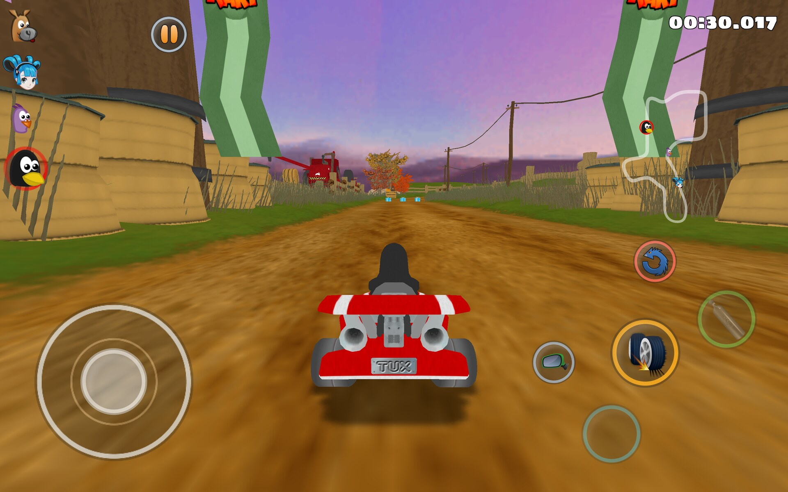
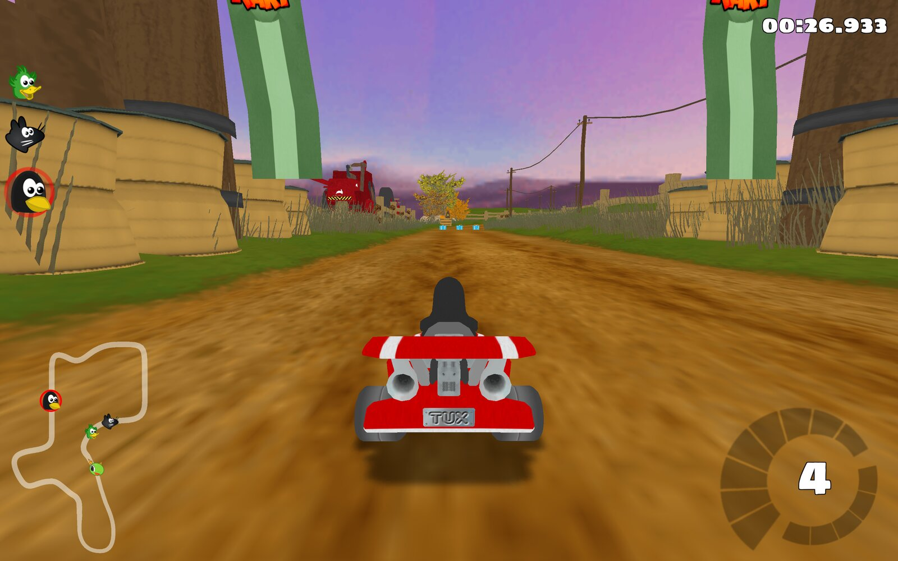

# Touch hardware detection

Upstream SuperTuxKart already has the control plane:

| Param | Values |
|-------|--------|
| `multitouch_active` | 0 = off, 1 = auto (if available), 2 = always |
| `multitouch_draw_gui` | Show the on-screen race buttons |
| `multitouch_controls` | Steering wheel / accelerometer / gyroscope |

Android and iOS assume a touchscreen. Linux tablets do not. This port keeps that
0/1/2 switch and adds a real scan plus a touch-only filter.

## What was missing

`CIrrDeviceSDL::supportsTouchDevice()` was only `SDL_GetNumTouchDevices() > 0`.
On Linux that is often 0 until the first finger, and convertibles with a
keyboard were treated the same as a phone.

`main_touch.cpp` used to **force** `multitouch_active = 2` after config load, so
the Auto setting could not stick.

## What we added

| Piece | Role |
|-------|------|
| `src/input/linux_touch_detect.hpp` | `/proc/bus/input/devices`, `SW_TABLET_MODE`, DMI chassis, Ubuntu Touch: touchscreen, keyboard and pointer presence; one cached snapshot for the whole process |
| `src/input/linux_input_monitor.cpp` | Event-driven hot-plug: inotify / netlink + the tablet switch in one epoll set |
| `src/input/input_hotplug.cpp` | Presence layer + confirmation layer, flips the HUD, shows a toast |
| `src/input/input_policy.hpp` | The decisions below as pure functions (unit-tested) |
| `CIrrDeviceSDL::supportsTouchDevice` | A direct SDL touch device (not SDL's mouse one, not a touchpad) **or** a procfs touchscreen |
| `CIrrDeviceSDL::hasHardwareKeyboard` | Real alphabetic keyboard, not gpio-keys |
| `multitouch_touch_only` | When Auto, put the controls away while a listed keyboard or gamepad is in use |
| `IrrDriver::isMultitouchEnabled()` | Single policy used by race GUI, input, options |
| Touch settings dialog | Off / Auto / Always spinner + touch-only checkbox |

## Defaults (this port)

- `multitouch_active` default **1 (Auto)** — no longer forced to Always
- `multitouch_touch_only` default **true** on `TOUCH_STK` builds
- On-screen buttons and the screen keyboard still default on
- Override: `STK_TOUCH_MODE=always|auto|off`

Official STK should keep `multitouch_touch_only` default **false** so existing
"if available" behaviour on any touchscreen does not change. The Touch port
opts into the stricter filter.

## The rules

1. **Presence comes from the system, never from input.** Touchscreen,
   keyboard, pointer (mouse / trackpoint / touchpad) and gamepad presence is
   what the platform lists: `/proc/bus/input/devices`, `SW_TABLET_MODE`,
   hot-plug and SDL's touch devices (the compositor's seat) on Linux;
   `InputManager` and `Configuration` on Android; SDL's opened controllers
   for gamepads. A mouse says nothing about a keyboard.
2. **Input only confirms.** Key presses count only while a keyboard is
   listed, gamepad activity only while a gamepad is listed. Keys with no
   listed keyboard (a remapper, a remote desktop, an IME) change nothing.
   Mouse events never count for anything.
3. **Mouse and touch work together.** Mouse use never hides the touch
   controls. A mouse click is also a (simulated) touch on every platform
   (`SDL_HINT_MOUSE_TOUCH_EVENTS`, Android's default), so the on-screen
   buttons take clicks while fingers use them too; SDL's touches from a
   mouse (`SDL_MOUSE_TOUCHID`) and mice from touches (`SDL_TOUCH_MOUSEID`)
   are never counted as presence or as someone touching the screen, and
   touch ids are kept per device so a mouse and a finger down at once do not
   share a slot.
4. **The touch controls hide only when the system lists a keyboard (or
   gamepad) and the player confirms it** by driving with it (the hysteresis
   under *Confirmation*). A keyboard merely being plugged in does not hide
   them; a real finger brings them back at once. Touch input is never
   disabled, only the buttons are put away.
5. **The on-screen keyboard** -- STK's own, the Android IME, the
   compositor's OSK -- comes up only when the system lists no keyboard, and
   there is a touchscreen or a gamepad to type with. Without a keyboard,
   focusing a text field also asks for the system keyboard (Android
   `showSoftInput`; on Linux the edit box calls `SDL_StartTextInput`, which
   enables Wayland text-input so GNOME / Lomiri can show their OSK when they
   are in touch mode).

## Detection

Same rules as Xonotic Touch (`docs/TOUCH_DETECTION.md` there):

1. SDL touch devices
2. `INPUT_PROP_DIRECT` / name `touchscreen` in `/proc/bus/input/devices`.
   Pen digitizers are direct too, so a stylus-only screen counts. Touchpads
   (`INPUT_PROP_POINTER`, or named touchpad/trackpad) never do.
3. A keyboard has letters, space and Enter (`KEY_Q`, `KEY_A`, `KEY_Z`,
   `KEY_SPACE`, `KEY_ENTER`), not just `KEY_A`, and is none of:
   - a gamepad (`BTN_GAMEPAD` / `BTN_JOYSTICK`: pads in keyboard mode);
   - a uinput device (sysfs under `/devices/virtual/input/`: keyd, ydotool,
     Steam Input, remote desktops). Bluetooth LE keyboards come through
     uhid under `/devices/virtual/misc/` and still count.
     `STK_INPUT_TRUST_UINPUT=1` counts uinput keyboards, for testing;
   - a button set, media control or vendor hotkey driver by name
     (power/sleep button, lid switch, gpio-keys, Intel HID, WMI hotkeys,
     extra buttons, Video Bus, HDA jacks, Steam Deck controller).
   Bus ids 0x03 (USB) and 0x05 (Bluetooth) mark it as plugged in by the
   player -- except a Surface Type Cover, which is part of the chassis.
4. A pointer is a mouse or trackpoint (`REL_X` + `REL_Y` + `BTN_LEFT`) or a
   touchpad (`INPUT_PROP_POINTER` with `BTN_LEFT` / `BTN_TOUCH` /
   `BTN_TOOL_FINGER`), and not a touchscreen, a gamepad or a uinput / virtual
   device (the same `STK_INPUT_TRUST_UINPUT=1` override applies).
5. `SW_TABLET_MODE` (Flatpak: `--device=input`). Engaged means the built-in
   keyboard is folded away or detached, whatever `/proc` still lists; a
   USB or Bluetooth keyboard still counts. The switch nodes are found from
   `/proc` (`B: SW=` plus the `eventN` handler), so only they are opened.
6. Chassis type 11 (handheld) or 30 (tablet): built-in keyboards ignored.
7. Ubuntu Touch / Lomiri / `CLICK_FRAMEWORK`: touch-only unless a keyboard
   is paired.

A laptop with a Type Cover is not touch-only. A phone is. A Surface with the
cover folded back is.

The DMI and Ubuntu Touch checks run once per process. None of this --
`/proc`, `/sys`, `/dev/input`, the Click markers -- is compiled on Android.

## Live hot-plug

| Touch-only (Type Cover folded back) | Same race, driving with a USB keyboard |
|---|---|
|  |  |

`InputHotplug::update()` runs every frame from the main loop. On Linux it
asks `LinuxInputMonitor`, which holds one epoll set:

- an inotify watch on `/dev/input` (create / delete / attribute change of
  the `eventN` nodes, which the kernel makes itself, so a device shows up
  the moment it registers and again when udev fixes its permissions);
- or, when `/dev/input` is not visible (a Flatpak without
  `--device=input`), a `NETLINK_KOBJECT_UEVENT` socket filtered to
  `SUBSYSTEM=input`;
- the `SW_TABLET_MODE` nodes, read as `EV_SW` events (and `SYN_DROPPED`,
  which triggers one `EVIOCGSW` to resync).

Idle, that is one `epoll_wait(fd, ..., 0)` per frame and nothing else. After
a wake-up, `/proc/bus/input/devices` is re-read once the burst settles
(50 ms; a USB keyboard registers two or three devices at once), and the
switch fds are re-synced only if the listing changed. With neither inotify
nor netlink, procfs is re-read every 3 s as a fallback.

Measured on an HP ProBook 440 G11 (`/tmp` bench linking the monitor):

| | Cost |
|---|---|
| Idle poll, per frame | 0.25-0.64 us (one syscall) |
| Old once-a-second procfs read | ~200 us |
| Re-read after an event (read + parse + classify) | ~210 us |
| Tablet switch flip -> snapshot updated | 2-4 ms |
| Keyboard plug / unplug -> snapshot updated | < 1 frame / ~40-50 ms (settle) |

SDL's own touch list is checked every frame as well (one array read), so a
touchscreen the compositor adds to the seat -- a remote desktop's virtual
one, a Wayland seat gaining touch -- is followed too.

When the answer changes -- a Type Cover clicks on, a Bluetooth keyboard
pairs, a convertible folds -- it:

- starts the confirmation layer over, and creates or destroys the
  `MultitouchDevice` and the race HUD in place
  (`RaceGUIBase::setMultitouchEnabled`) when the policy says so: the stick
  comes back mid-race when a keyboard goes, but a keyboard arriving leaves
  it up until the player drives with it;
- stops STK's own screen keyboard from opening while a real one is attached
  (`ScreenKeyboard::shouldUseScreenKeyboard`), and dismisses an open one;
- logs `keyboard= touch= pointer= gamepad=` and shows a toast: *Keyboard
  connected* / *Keyboard disconnected: touch controls shown* /
  *Touchscreen detected: touch controls shown*.

## Confirmation

Presence is the starting point; what the player actually does picks between
the devices the system lists, like games switching their button prompts.
Every touch and key event is seen first thing in `EventHandler::OnEvent`
(before menus, dialogs or the screen keyboard can swallow it), gamepads in
`InputManager::handleJoystick`.

| Evidence | Result |
|---|---|
| A finger or stylus down (`SDL_FINGERDOWN` from a direct touch device) | Touch controls shown at once, keyboard attached or not |
| 4 presses of keys bound in a keyboard config within 2.5 s, no touch, **while a keyboard is listed** | Hidden |
| 2 gamepad activations within 2.5 s (button, hat, stick past ~75%), **while a gamepad is listed** | Hidden |
| A keyboard / touchscreen plugged or unplugged | Layer reset; presence decides again |

Not evidence: touches SDL synthesises from a mouse (`SDL_MOUSE_TOUCHID`) or
reports from a touchpad (`SDL_TOUCH_DEVICE_INDIRECT_*`, flagged
`STouchInput::Simulated`), mouse events at all, key presses with no listed
keyboard, key auto-repeat, modifier and Escape keys, and anything typed into
a text box or the screen keyboard. Hiding waits 1.5 s after the last switch,
so alternating finger and keys cannot strobe the HUD; showing on touch is
always immediate.

Toasts: *Touch detected: touch controls shown*, *Keyboard in use: touch
controls hidden*, *Gamepad in use: touch controls hidden*.

Only `multitouch_active = 1` (Auto) reacts. *Always* keeps the touch UI on
whatever is plugged in; *Off* never shows it. With `multitouch_touch_only`
off, Auto keeps upstream's "if available": shown on any touchscreen, and
keyboard use does not put it away.

The screen keyboard does not follow this layer: it depends on keyboard
presence alone (rule 5), so tapping a text box with a finger while a
keyboard is listed does not open it.

## Android

`SuperTuxKartActivity` tells the game through
`InputManager.InputDeviceListener` and `onConfigurationChanged`
(`handleInputPresence(keyboard, pointer)` JNI), and the game also pulls the
starting state (`queryInputPresence`) because the first push can come before
the natives are registered. A keyboard is an enabled, non-virtual, alphabetic
`SOURCE_KEYBOARD` device that is not also a gamepad or joystick and is not
named virtual / uinput / fingerprint / gpio. `hardKeyboardHidden=YES`
(folded cover, DeX or ChromeOS tablet mode) means no keyboard;
`keyboard=QWERTY` alone is not trusted, because Android sets it for
gamepads too. A mouse receiver that also exposes a keyboard still counts as
a keyboard -- it is listed, so driving with it hides the controls and one
touch brings them back. A pointer is an enabled, non-virtual
`SOURCE_MOUSE`, `SOURCE_MOUSE_RELATIVE` or `SOURCE_TOUCHPAD` device that is
not the touchscreen or a stylus. The confirmation layer is shared C++ and
works the same there.

Text boxes always take their text through `STKEditText` (a hardware
keyboard's text arrives that way too), but `showKeyboard` only calls
`showSoftInput` when no keyboard is listed. `isHardwareKeyboardConnected()`
uses the same filtered list rather than `Configuration.keyboard`, which is
`QWERTY` for gamepads and receiver dongles.

## Testing without hardware

- `scripts/test-input-presence.sh` checks parsing and the decisions against
  recorded `/proc/bus/input/devices` listings in `tests/input-presence/`
  (laptop with keyd / ydotool uinput devices, touch-only tablet, Surface with
  Type Cover open and folded, uinput keyboard and mouse, gamepads, tablet with
  a Bluetooth mouse, desktop). CI runs it on every branch and before a
  release.

- `scripts/fake-keyboard.py 8 --press up,left,right,left` plugs in a USB
  keyboard and drives with it. It is a uinput device, so run the game with
  `STK_INPUT_TRUST_UINPUT=1` for it to count as plugged in.
- `scripts/fake-tablet-mode.py on:5 off:3` flips a `SW_TABLET_MODE` switch.
- `scripts/fake-touch.py tap:X:Y` creates a uinput touchscreen for the run
  and taps native screen pixels, which the compositor delivers as real
  touch events (a remote pointer click is not the same thing to SDL).

## Upstream

- PR: https://github.com/supertuxkart/stk-code/pull/5830
- Official contact is GitHub + the [STK forums](https://supertuxkart.net/Community), not phone.
